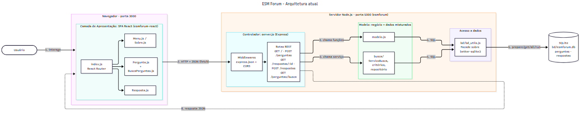

# Análise Arquitetural do ESM Forum

## a) Identificação da arquitetura

### Estilos arquiteturais

O ESM Forum combina três estilos que se complementam:

**1. Cliente-servidor, com o frontend separado do backend.** São dois programas independentes, em repositórios distintos, que rodam em processos (e portas) diferentes:

| | Frontend | Backend |
|---|---|---|
| Repositório | `esmforum-react` | `esmforum` |
| Tecnologia | React 18 + React Router + React-Bootstrap | Node.js + Express 4 + better-sqlite3 |
| Onde roda | no navegador do usuário | no servidor |
| Porta (dev) | 3000 | 5000 |

**2. SPA (Single Page Application) consumindo uma API REST.** O servidor não gera HTML. O navegador baixa uma vez a aplicação React, e a partir daí a navegação entre "Perguntas", "Respostas" e "Sobre" acontece no próprio navegador, pelo React Router, sem recarregar a página. Os dados vêm de uma API REST que responde apenas JSON.

**3. MVC, numa variação para aplicações web modernas.** A documentação do próprio projeto (`docs/arquitetura.md`) classifica o sistema assim:

- **Visão** → a SPA React (no navegador);
- **Controlador** → `server.js`, que recebe as requisições HTTP e decide o que chamar;
- **Modelo** → `modelo.js`, com as funções de negócio e persistência.

Eu acrescentaria que, olhando só o backend, é também uma **arquitetura em camadas** simples, com dependência sempre de cima para baixo: `server.js` → `modelo.js` → `bd_utils.js` → SQLite. Nenhuma camada de baixo chama uma de cima.

### Camadas existentes

| Camada | Onde | Responsabilidade atual | Observação |
|---|---|---|---|
| **Apresentação** | `esmforum-react/src/pages/*.js` | Mostrar perguntas e respostas, capturar formulários e chamar a API com `fetch`. | Cada página chama a API direto, com a URL `http://localhost:5000` repetida em vários arquivos. Não há uma camada de "cliente da API". |
| **Controle / API** | `server.js` | Definir rotas, ler parâmetros, chamar o modelo, devolver JSON e tratar erros. | Todas as rotas num arquivo só. Não há validação de entrada (uma pergunta vazia é aceita). |
| **Negócio** | `modelo.js` | Regras: autor fixo (`id_usuario = 1`), contagem de respostas. | **Misturada com a camada de dados.** Regra e SQL convivem nas mesmas funções. |
| **Dados** | `modelo.js` (SQL) + `bd/bd_utils.js` (acesso) | Montar SQL (modelo) e executá-lo (bd_utils). | `bd_utils` é uma boa fachada. Mas o SQL fica espalhado no modelo. |
| **Persistência** | `bd/esmforum.db` (SQLite), `bd/schema.sql` | Guardar perguntas e respostas. | Arquivo local, sem servidor de banco. Não há migrações, só um script que recria tudo do zero. |

Na prática, então, as camadas de **negócio e dados não estão separadas**: são uma só, `modelo.js`. O módulo `busca/` que implementei na Parte 3 é a exceção. Nele, validação, serviço (negócio) e repositório (dados) já estão em módulos distintos, e ele funciona como um primeiro exemplo da organização proposta em [PROPOSTA_ARQUITETURA.md](PROPOSTA_ARQUITETURA.md).

### Como o frontend e o backend se comunicam

- **Protocolo:** HTTP, no estilo REST, com corpo e respostas em **JSON**.
- **No frontend:** a API nativa `fetch` do navegador, chamada dentro dos componentes (em `useEffect` para carregar dados e em funções de clique para enviar).
- **CORS:** como as origens são diferentes (porta 3000 → porta 5000), o navegador bloquearia as chamadas. O backend libera isso com um middleware que adiciona `Access-Control-Allow-Origin: *`.
- **Sem estado de sessão:** não há login, cookies nem tokens. Cada requisição é independente (*stateless*).
- **Contrato da API:**

| Método e rota | Uso | Corpo enviado | Resposta |
|---|---|---|---|
| `GET /` | Listar perguntas | — | `[{ id_pergunta, texto, id_usuario, num_respostas }]` |
| `POST /perguntas` | Cadastrar pergunta | `{ pergunta }` | `{ id_pergunta }` |
| `GET /respostas/:id_pergunta` | Pergunta + suas respostas | — | `{ pergunta, respostas: [...] }` |
| `POST /respostas` | Cadastrar resposta | `{ id_pergunta, resposta }` | `{ id_resposta }` |
| `GET /perguntas/busca?q=&sem_resposta=` | **Buscar (novo, Parte 3)** | — | `{ termo, total, perguntas: [...] }` |

Algumas inconsistências da API atual ficam visíveis nessa tabela, e a proposta arquitetural as corrige: a listagem está em `GET /` e não em `GET /perguntas`; o campo enviado é `pergunta`, mas o armazenado é `texto`; as respostas são cadastradas em `/respostas`, e não em `/perguntas/:id/respostas`; e os erros originais são devolvidos como uma string JSON solta, sem um formato padrão.

## b) Diagrama arquitetural

*Fonte: [diagramas/arquitetura_atual.mmd](diagramas/arquitetura_atual.mmd)*

**Componentes e responsabilidades:**
- **SPA React (porta 3000):** `index.js` configura as rotas do navegador. `Pergunta.js` (com o novo `BuscaPerguntas.js`) lista, busca e cadastra perguntas. `Resposta.js` mostra e cadastra respostas. `Menu.js` e `Sobre.js` cuidam de navegação e conteúdo estático.
- **Controlador (`server.js`):** os middlewares (`express.json` e CORS) processam toda requisição antes das rotas, formando uma *Chain of Responsibility* (ver [PADROES_EXISTENTES.md](PADROES_EXISTENTES.md)). Depois, as rotas REST despacham para o modelo ou para o serviço de busca.
- **Modelo:** `modelo.js` (negócio e SQL juntos) e o módulo `busca/` (já separado em serviço, critérios e repositório).
- **Acesso a dados (`bd_utils.js`):** a fachada sobre o `better-sqlite3`, usada por ambos.
- **SQLite:** um arquivo local com as tabelas `perguntas` e `respostas`.

**Fluxo de dados** (números no diagrama), usando "listar perguntas" como exemplo:
1. O usuário abre a página de perguntas.
2. O componente `Pergunta` dispara `fetch("http://localhost:5000")`, uma requisição HTTP `GET /`.
3. A requisição passa pelos middlewares, e a rota chama `modelo.listar_perguntas()`.
4. O modelo monta o SQL e chama `bd.queryAll(...)`.
5. O `bd_utils` executa o SQL no SQLite (`prepare(...).all(...)`) e devolve as linhas como objetos JavaScript.
6. A rota serializa o resultado em JSON e o devolve. O React guarda os dados com `setListaPerguntas`, o que dispara a renderização da tabela.

## Avaliação

**O que funciona bem.** Para o objetivo didático do projeto, a arquitetura é adequada: é fácil de entender, cada peça tem um papel reconhecível, e a separação entre frontend e backend já permite que os dois evoluam de forma independente.

**Onde ela começa a limitar**, e por isso a proposta:
1. **Negócio e dados na mesma camada.** Cada funcionalidade nova (votos, tags, perfil) vai inchar o `modelo.js`, e as regras não podem ser testadas sem SQL.
2. **Um único arquivo de rotas.** Com as cinco funcionalidades, o `server.js` passaria de 4 para cerca de 15 rotas, misturando assuntos diferentes.
3. **Nenhuma camada de "view" no backend.** As rotas devolvem direto as linhas do banco, então qualquer mudança no esquema vaza para o contrato da API (e quebra o frontend).
4. **Configuração fixa no código.** A porta 5000, o caminho do banco e a URL da API no frontend estão escritos diretamente no código, o que dificulta ter ambientes diferentes (desenvolvimento, teste, produção).
