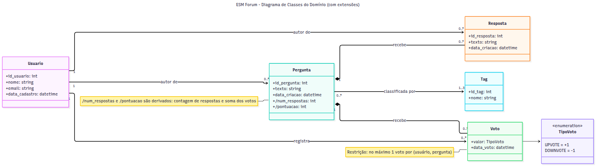
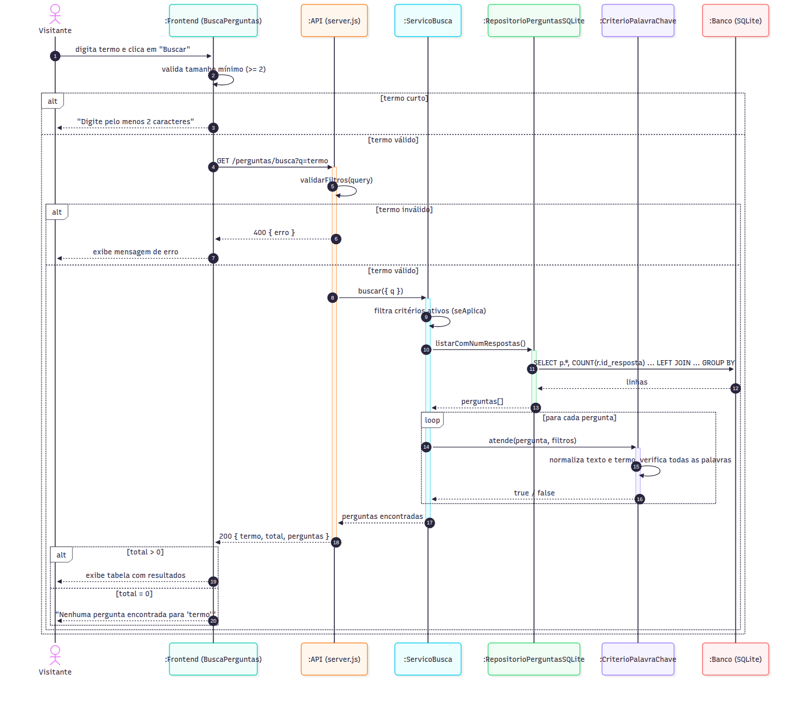
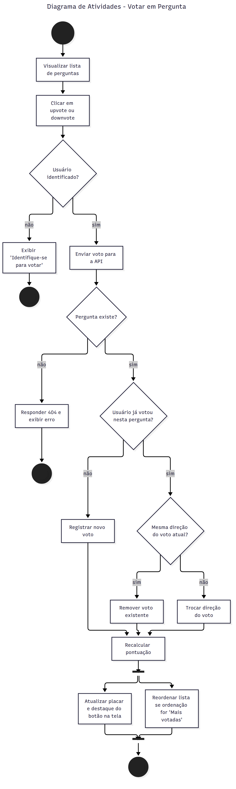
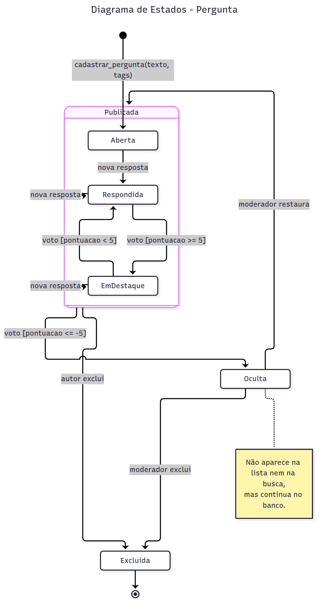

# Diagramas UML (Parte 2)

Todos os diagramas foram feitos em **Mermaid**, usando UML como *sketch*: o objetivo é comunicar as decisões de design, e não documentar cada detalhe. Cada diagrama tem:

- o **arquivo fonte** `.mmd` na pasta [`diagramas/`](diagramas/), que pode ser aberto e editado em [mermaid.live](https://mermaid.live);
- a **imagem** `.png` gerada a partir dele com `mermaid-cli` (`mmdc -i arquivo.mmd -o arquivo.png`).

| Diagrama | Imagem | Fonte |
|---|---|---|
| Classes | [diagrama_classes.png](diagramas/diagrama_classes.png) | [diagrama_classes.mmd](diagramas/diagrama_classes.mmd) |
| Sequência | [diagrama_sequencia.png](diagramas/diagrama_sequencia.png) | [diagrama_sequencia.mmd](diagramas/diagrama_sequencia.mmd) |
| Atividades | [diagrama_atividades.png](diagramas/diagrama_atividades.png) | [diagrama_atividades.mmd](diagramas/diagrama_atividades.mmd) |
| Estados | [diagrama_estados.png](diagramas/diagrama_estados.png) | [diagrama_estados.mmd](diagramas/diagrama_estados.mmd) |

---

## a) Diagrama de Classes

O diagrama mostra o domínio do ESM Forum **já com as extensões** das três histórias escolhidas.

**Classes do sistema atual.** `Pergunta` e `Resposta` existem hoje como tabelas. `Usuario` existe só como a coluna `id_usuario` em `perguntas` (sempre com valor `1`). No diagrama, ela aparece como classe de verdade, porque votação e autoria dependem dela.

**Classes novas.**
- `Tag` (História 2): uma pergunta tem de 1 a 3 tags, e uma tag classifica qualquer número de perguntas. É uma associação muitos-para-muitos, que no banco vira uma tabela de associação `pergunta_tags`.
- `Voto` e `TipoVoto` (História 3): o voto liga um usuário a uma pergunta e guarda o valor (+1 ou −1). Modelei `Voto` como classe, e não como um simples contador em `Pergunta`, porque a regra "um voto por usuário por pergunta" exige saber *quem* votou. Um contador não permitiria trocar nem remover o voto.

**Decisões que vale destacar.**
- **Composição** (losango preenchido) entre `Pergunta` e `Resposta`, e entre `Pergunta` e `Voto`: respostas e votos não existem sem a pergunta. Se a pergunta for excluída, eles também são.
- **Atributos derivados** (prefixo `/`): `num_respostas` e `pontuacao` não são armazenados, são calculados (contagem de respostas e soma dos votos). Isso evita inconsistência entre o valor guardado e os dados reais.
- **Nova associação `Usuario` → `Resposta`**: hoje a tabela `respostas` não tem `id_usuario`, o que impede, por exemplo, montar o histórico de um usuário. O diagrama já corrige isso.
- **A busca (História 1) não aparece aqui** porque não cria nenhum dado novo: ela só lê perguntas existentes. As classes que implementam a busca são de *aplicação*, não de domínio, e estão em [IMPLEMENTACAO_SOLID.md](IMPLEMENTACAO_SOLID.md).

---

## b) Diagrama de Sequência: Buscar Perguntas por Palavra-Chave

Modela o caso de uso de [CASO_DE_USO.md](CASO_DE_USO.md), e os objetos correspondem às classes que implementei na Parte 3.

- **Os dois níveis de validação** aparecem como fragmentos `alt`: o frontend barra termos curtos sem chamar a API (FA1), e a API valida de novo e responde **400** para chamadas diretas (FE1). Validar só no frontend não basta, porque qualquer pessoa pode chamar a API diretamente.
- **Uma única consulta ao banco** (`LEFT JOIN` + `COUNT`) traz as perguntas com o número de respostas. É a simplificação proposta em [DESIGN_SIMPLES.md](DESIGN_SIMPLES.md), em vez de uma consulta por pergunta.
- **O `loop`** mostra o `ServicoBusca` perguntando a cada critério se a pergunta o atende. O serviço não sabe *como* o critério decide, e é isso que permite acrescentar critérios novos (como "só sem resposta") sem mexer no serviço.
- **O resultado vazio** (FA2) é tratado no frontend com uma mensagem, e não como erro.

---

## c) Diagrama de Atividades: Votar em Pergunta

Escolhi a votação (História 3) em vez de repetir a busca porque é a funcionalidade com **mais decisões**, e o diagrama de atividades é justamente a ferramenta certa para mostrar ramificações de regra de negócio.

- **Três decisões em sequência** definem o que acontece com o voto: o usuário está identificado? a pergunta existe? o usuário já votou? Quando ele já votou, uma quarta decisão separa **remover** (clicou no mesmo botão) de **trocar** (clicou no oposto). Esses caminhos correspondem diretamente aos critérios de aceitação da História 3.
- **Os três caminhos convergem** em "Recalcular pontuação", o que mostra que a regra de pontuação é uma só, independentemente de como o voto mudou.
- **Fluxo paralelo** (barras de *fork* e *join*): depois de recalcular, a atualização do placar e a reordenação da lista acontecem de forma independente. No React, são duas atualizações de estado que não precisam esperar uma pela outra.
- Há **três nós finais**: dois de término antecipado (usuário não identificado, pergunta inexistente) e um de sucesso.

---

## d) Diagrama de Estados: Pergunta

O objeto escolhido é `Pergunta`, porque é ele que muda de comportamento conforme respostas e votos chegam.

| Estado | Significado |
|---|---|
| **Aberta** | Cadastrada, ainda sem respostas. É o estado filtrado pela opção "Só sem resposta" da busca. |
| **Respondida** | Tem pelo menos uma resposta. |
| **EmDestaque** | Tem respostas **e** pontuação ≥ 5. Aparece com destaque na lista. |
| **Oculta** | Pontuação ≤ −5. Some da lista e da busca, mas continua no banco e pode ser restaurada por um moderador. |
| **Excluida** | Removida pelo autor ou por um moderador. É o estado final. |

- **Estado composto `Publicada`**: agrupa os três estados em que a pergunta é visível. Com isso, as transições para `Oculta` e `Excluida` são desenhadas uma vez só, saindo do estado composto, em vez de três vezes.
- **Transições com guarda** (`voto [pontuacao >= 5]`): o mesmo evento (um voto) leva a estados diferentes conforme a pontuação resultante.
- **Transições reflexivas**: uma nova resposta em uma pergunta `Respondida` ou `EmDestaque` não muda o seu estado.
- Os limites de **+5** e **−5** e a figura do moderador são **propostas minhas** para dar consequência à votação. Não estão no pedido original do cliente e precisariam ser validados com ele.
