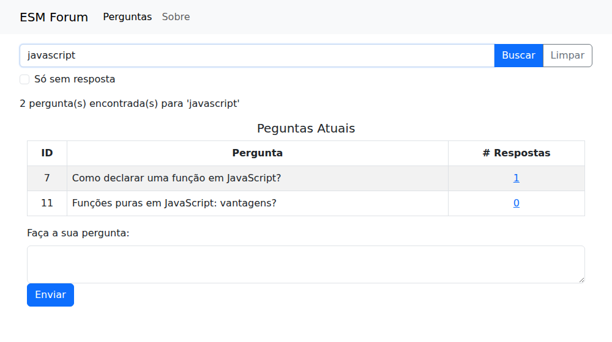
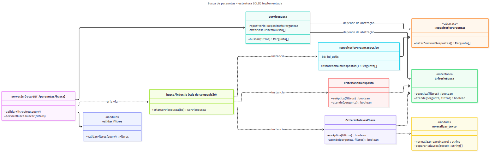

# Implementação com SOLID: Busca de Perguntas por Palavra-Chave

## Qual funcionalidade foi implementada

Implementei a **busca de perguntas por palavra-chave** (História 1 de [HISTORIAS.md](HISTORIAS.md), caso de uso em [CASO_DE_USO.md](CASO_DE_USO.md)), de ponta a ponta:

- **Backend** (este repositório): endpoint `GET /perguntas/busca?q=<termo>[&sem_resposta=true]`.
- **Frontend** (`esmforum-react`): campo de busca na página de perguntas, com botões Buscar e Limpar e a opção "Só sem resposta".

Escolhi a busca por ser a primeira da fila de prioridade no board e por não exigir mudanças no esquema do banco. Assim, toda a atenção pôde ir para a *estrutura* do código, que é o objetivo desta tarefa.



### Como testar

```bash
npm test                   # 37 testes: unidade, integração e API
node server.js
curl "http://localhost:5000/perguntas/busca?q=javascript"
curl "http://localhost:5000/perguntas/busca?q=git&sem_resposta=true"
curl "http://localhost:5000/perguntas/busca?q=a"          # 400: termo curto
```

Resposta de exemplo:

```json
{
  "termo": "javascript",
  "total": 2,
  "perguntas": [
    { "id_pergunta": 7,  "texto": "Como declarar uma função em JavaScript?", "id_usuario": 1, "num_respostas": 1 },
    { "id_pergunta": 11, "texto": "Funções puras em JavaScript: vantagens?", "id_usuario": 1, "num_respostas": 0 }
  ]
}
```

## Estrutura

```
busca/
├── index.js                          # raiz de composição: liga as peças concretas
├── servico_busca.js                  # ServicoBusca: orquestra repositório + critérios
├── repositorio_perguntas.js          # RepositorioPerguntas: abstração (contrato)
├── repositorio_perguntas_sqlite.js   # implementação SQLite do repositório
├── validar_filtros.js                # query string HTTP -> filtros válidos (ou 400)
├── normalizar_texto.js               # minúsculas, sem acentos, espaços unificados
└── criterios/
    ├── criterio_palavra_chave.js     # contém todas as palavras do termo
    └── criterio_sem_resposta.js      # só perguntas com 0 respostas
testes/busca/                         # um arquivo de teste por módulo + teste da API
```



*Fonte: [diagramas/implementacao_busca_classes.mmd](diagramas/implementacao_busca_classes.mmd)*

A evolução ficou registrada em commits pequenos, um por etapa: normalização → repositório → critérios e serviço → endpoint → frontend.

---

## Como cada princípio foi aplicado

### S: Princípio da Responsabilidade Única (SRP)

Cada módulo responde a **um** motivo de mudança:

| Módulo | Responsabilidade | Muda quando... |
|---|---|---|
| `validar_filtros.js` | Traduzir a requisição HTTP em filtros | as regras de entrada mudarem (ex.: tamanho máximo do termo) |
| `ServicoBusca` | Combinar repositório e critérios | a *forma* de combinar mudar (ex.: passar a ser "OU" em vez de "E") |
| `RepositorioPerguntasSQLite` | Ler perguntas do SQLite | o esquema ou o banco mudarem |
| `CriterioPalavraChave` | Decidir se o texto casa com o termo | a regra de correspondência mudar |
| `CriterioSemResposta` | Decidir se a pergunta está sem resposta | essa regra mudar |
| `normalizar_texto.js` | Canonizar textos para comparação | a regra de acentos ou maiúsculas mudar |
| `busca/index.js` | Montar o grafo de objetos | um critério for incluído ou removido |

O contraste com o `modelo.js` original é direto: lá, SQL, regras e duas entidades conviviam no mesmo arquivo (ver [ANALISE_SOLID.md](ANALISE_SOLID.md)). Um exemplo concreto: a validação ficou **fora** do serviço de propósito. O `ServicoBusca` recebe filtros já prontos (`{ q: 'git', sem_resposta: true }`) e não sabe que eles vieram de uma URL. Se amanhã a busca for chamada por um job ou por uma interface de linha de comando, o serviço funciona igual.

```js
// busca/validar_filtros.js: só regras de entrada
function validarFiltros(query) {
  const q = typeof query.q === 'string' ? query.q.trim() : '';
  if (q.length < TAMANHO_MINIMO) {
    throw new ErroValidacao(`O termo de busca deve ter pelo menos ${TAMANHO_MINIMO} caracteres.`);
  }
  if (q.length > TAMANHO_MAXIMO) {
    throw new ErroValidacao(`O termo de busca deve ter no máximo ${TAMANHO_MAXIMO} caracteres.`);
  }
  return { q, sem_resposta: query.sem_resposta === 'true' };
}
```

A rota em `server.js` ficou com uma só tarefa: traduzir entre HTTP e o serviço, incluindo o mapeamento de erros para status.

```js
app.get('/perguntas/busca', (req, res) => {
  try {
    const filtros = validarFiltros(req.query);
    const perguntas = servicoBusca.buscar(filtros);
    res.json({ termo: filtros.q, total: perguntas.length, perguntas: perguntas });
  }
  catch(erro) {
    const status = erro instanceof ErroValidacao ? 400 : 500;
    res.status(status).json({ erro: erro.message });
  }
});
```

### D: Princípio da Inversão de Dependência (DIP)

O `ServicoBusca` é a política de alto nível. Ele **não importa nenhuma classe concreta**: recebe pelo construtor um repositório e uma lista de critérios, e conhece apenas os seus contratos.

```js
// busca/servico_busca.js: nenhum require
class ServicoBusca {
  constructor(repositorio, criterios) {
    this.repositorio = repositorio;
    this.criterios = criterios;
  }

  buscar(filtros) {
    const ativos = this.criterios.filter(criterio => criterio.seAplica(filtros));
    return this.repositorio
      .listarComNumRespostas()
      .filter(pergunta => ativos.every(criterio => criterio.atende(pergunta, filtros)));
  }
}
```

O contrato do repositório é explicitado por uma classe abstrata. Como JavaScript não tem `interface`, a classe base falha com uma mensagem clara se uma implementação esquecer o método:

```js
// busca/repositorio_perguntas.js: a abstração
class RepositorioPerguntas {
  listarComNumRespostas() {
    throw new Error(`${this.constructor.name} deve implementar listarComNumRespostas()`);
  }
}

// busca/repositorio_perguntas_sqlite.js: o detalhe, que depende da abstração
class RepositorioPerguntasSQLite extends RepositorioPerguntas {
  constructor(bd) { super(); this.bd = bd; }      // bd também é injetado
  listarComNumRespostas() {
    return this.bd.queryAll(`SELECT p.id_pergunta, p.texto, p.id_usuario,
                                    COUNT(r.id_resposta) AS num_respostas
                               FROM perguntas p LEFT JOIN respostas r ON r.id_pergunta = p.id_pergunta
                              GROUP BY p.id_pergunta ORDER BY p.id_pergunta`, []);
  }
}
```

A direção da dependência se inverte: o SQLite (detalhe) se adapta ao contrato definido pela necessidade da busca (política), e não o contrário. O **único** lugar que conhece as classes concretas é a raiz de composição:

```js
// busca/index.js
function criarServicoBusca(bd) {
  return new ServicoBusca(
    new RepositorioPerguntasSQLite(bd),
    [new CriterioPalavraChave(), new CriterioSemResposta()]
  );
}
```

**O ganho prático aparece nos testes.** O serviço é testado com um repositório em memória de três linhas, sem banco de dados, sem arquivos e sem `jest.mock`:

```js
// testes/busca/servico_busca.test.js
class RepositorioEmMemoria {
  constructor(perguntas) { this.perguntas = perguntas; }
  listarComNumRespostas() { return this.perguntas; }
}

const servico = new ServicoBusca(new RepositorioEmMemoria(perguntas), [new CriterioPalavraChave()]);
expect(servico.buscar({ q: 'rebase' }).map(p => p.id_pergunta)).toEqual([1, 2]);
```

Compare com o `modelo.js` original, em que foi preciso trocar uma variável global do módulo (`reconfig_bd`) e simular chamadas SQL na ordem exata em que acontecem.

### O: Princípio Aberto/Fechado (OCP)

Cada critério de busca é uma classe com o mesmo contrato: `seAplica(filtros)` diz se o critério participa desta busca, e `atende(pergunta, filtros)` diz se a pergunta passa. O `ServicoBusca` trata todos da mesma forma. Isso é o padrão **Strategy**.

```js
// busca/criterios/criterio_palavra_chave.js
class CriterioPalavraChave {
  seAplica(filtros) {
    return separarPalavras(filtros.q).length > 0;
  }
  atende(pergunta, filtros) {
    const texto = normalizarTexto(pergunta.texto);
    return separarPalavras(filtros.q).every(palavra => texto.includes(palavra));
  }
}
```

**A prova de que o OCP funciona foi feita na prática.** O filtro "Só sem resposta" (fluxo alternativo FA4 do caso de uso) foi acrescentado **depois** que o `ServicoBusca` estava pronto e testado. Para isso:

1. criei uma classe nova, `CriterioSemResposta`;
2. registrei a classe na lista em `busca/index.js`.

O `servico_busca.js` **não foi modificado**. Ele está *fechado* para modificação e *aberto* para extensão.

```js
// busca/criterios/criterio_sem_resposta.js: extensão sem modificação
class CriterioSemResposta {
  seAplica(filtros) { return filtros.sem_resposta === true; }
  atende(pergunta)  { return pergunta.num_respostas === 0; }
}
```

Os próximos itens do backlog se encaixam da mesma forma: quando existirem tags (História 2), o filtro por categoria será um `CriterioTag`, e o serviço continua intocado. Há também um teste que documenta essa propriedade, injetando um critério inventado na hora:

```js
test('OCP: aceita um critério novo sem modificar o serviço', () => {
  const criterioIdPar = {
    seAplica: filtros => filtros.somente_pares === true,
    atende: pergunta => pergunta.id_pergunta % 2 === 0,
  };
  const servico = criarServico([new CriterioPalavraChave(), criterioIdPar]);
  expect(servico.buscar({ q: 'rebase', somente_pares: true }).map(p => p.id_pergunta)).toEqual([2]);
});
```

### L e I, de quebra

- **LSP:** `RepositorioPerguntasSQLite` e o `RepositorioEmMemoria` dos testes são intercambiáveis para o `ServicoBusca`, e ambos cumprem o mesmo contrato (retornar perguntas com `num_respostas`). O mesmo vale para qualquer critério.
- **ISP:** o contrato de critério tem só dois métodos, e o de repositório só um. Nenhuma implementação é obrigada a oferecer algo que o serviço não usa. O repositório de busca não expõe `cadastrar` nem `excluir`, porque a busca não precisa deles.

### Frontend

No React, o mesmo raciocínio de SRP se aplica em escala menor. O componente novo `BuscaPerguntas` só coleta o termo, chama a API e avisa o pai por *callbacks* (`onResultado`, `onLimpar`, `onErro`). Quem decide como exibir os resultados é a página `Pergunta`. Assim, o componente de busca pode ser reaproveitado em outra página sem mudanças.

---

## Decisões e limites (sendo honesta)

- **Filtragem em memória.** Os critérios filtram as perguntas no Node, e não no SQL. Isso foi uma escolha: é o que permite que cada critério seja uma classe independente e testável sem banco, e é o que torna a normalização de acentos simples (o SQLite não compara `função` com `funcao` nativamente). O custo é carregar todas as perguntas a cada busca. Para o tamanho de um fórum didático isso não é problema. Para centenas de milhares de perguntas, eu trocaria o `RepositorioPerguntasSQLite` por uma implementação com índice de texto completo (FTS5 do SQLite), **sem mudar o serviço nem os critérios**, e é justamente o DIP que torna essa troca barata.
- **Busca por substring.** "declar" encontra "declarar" e "declaração", e "funcao" encontra "função", mas não "funções" (depois de normalizada, "funcoes" não contém "funcao"). Reconhecer plurais exigiria *stemming*, e isso seria um novo critério, não uma mudança nos existentes.
- **Mudanças de apoio.** Para testar a API, `server.js` passou a exportar o `app` e só escuta a porta quando executado diretamente. Também removi a dependência não usada `sqlite3`, configurei `npm test` para rodar em sequência (os testes de integração compartilham o banco de teste) e declarei o ambiente Jest no ESLint.
