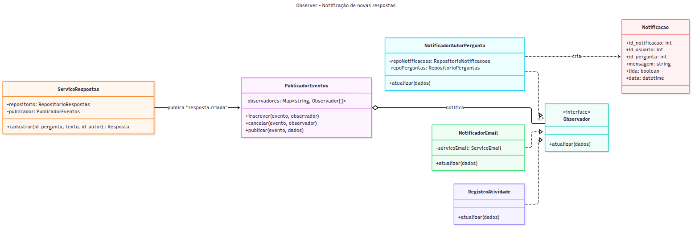
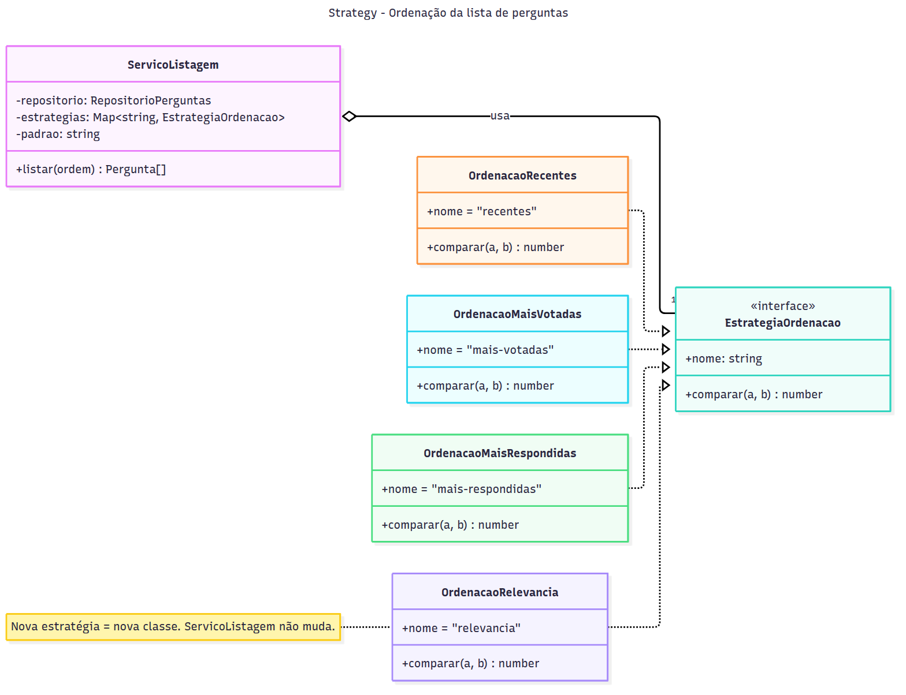
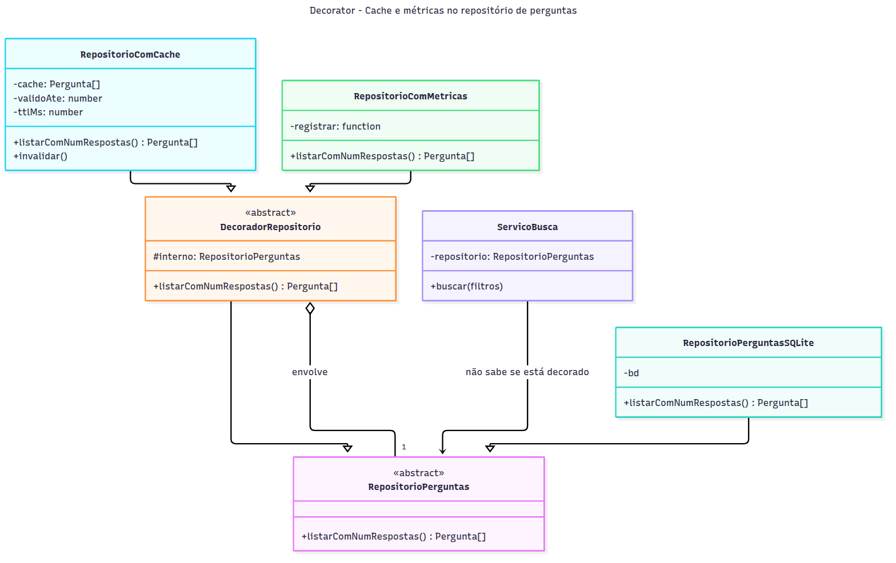

# Proposta de Aplicação de Padrões de Projeto

Proponho três padrões (dois comportamentais e um estrutural), cada um ligado a uma funcionalidade do backlog:

| # | Padrão | Categoria | Funcionalidade | Problema que resolve |
|---|---|---|---|---|
| 1 | **Observer** | Comportamental | Notificação de novas respostas | Avisar vários interessados quando uma resposta é criada, sem que o cadastro de respostas conheça cada um deles. |
| 2 | **Strategy** | Comportamental | Votação ("ordenar por mais votadas") | Trocar o critério de ordenação da lista sem encher o código de `if/else`. |
| 3 | **Decorator** | Estrutural | Busca e listagem (desempenho) | Acrescentar cache e métricas ao repositório sem modificá-lo. |

Os diagramas estão em [`diagramas/`](diagramas/), cada um com o fonte `.mmd` (Mermaid) e a imagem `.png`. O código é JavaScript simplificado, no mesmo estilo do que implementei na busca.

---

## 1. Observer: Notificação de novas respostas

### a) Justificativa e contexto

**Funcionalidade:** "Notificação de novas respostas às suas perguntas" (item 5 do backlog).

**O problema.** Quando alguém responde uma pergunta, várias coisas deveriam acontecer: (1) criar uma notificação para o autor da pergunta; (2) talvez enviar um e-mail; (3) talvez registrar a atividade no perfil do usuário (item 4 do backlog); e, no futuro, (4) quem sabe notificar quem "seguiu" a pergunta. A solução ingênua é colocar tudo isso dentro de `cadastrar_resposta`:

```js
// o que NÃO quero
function cadastrar_resposta(id_pergunta, texto, id_autor) {
  const id = bd.exec('INSERT INTO respostas ...');
  const pergunta = bd.query('SELECT ... WHERE id_pergunta = ?');
  bd.exec('INSERT INTO notificacoes ...');             // notificação
  if (usuario.quer_email) enviarEmail(...);            // e-mail
  bd.exec('INSERT INTO atividades ...');               // histórico do perfil
  return id;
}
```

Isso viola o SRP (cadastrar uma resposta vira "cadastrar + notificar + enviar e-mail + registrar histórico") e o OCP (cada reação nova modifica essa função). Além disso, uma falha no envio de e-mail poderia impedir o cadastro da resposta, o que não faz sentido para o usuário.

**Por que Observer.** O padrão existe exatamente para uma relação **um-para-muitos** em que o objeto que muda (o *sujeito*) não deve conhecer os interessados (os *observadores*). O serviço de respostas só anuncia "uma resposta foi criada", e quem se interessa se inscreve.

### b) Proposta de solução



*Fonte: [diagramas/padrao_observer.mmd](diagramas/padrao_observer.mmd)*

**Classes e módulos:**

| Classe | Papel no padrão | Responsabilidade |
|---|---|---|
| `PublicadorEventos` | Sujeito (genérico) | Mantém a lista de observadores por nome de evento e os notifica. |
| `Observador` | Interface do observador | Contrato: `atualizar(dados)`. |
| `ServicoRespostas` | Cliente do sujeito | Cadastra a resposta e **publica** `resposta.criada`. Não conhece nenhum observador. |
| `NotificadorAutorPergunta` | Observador concreto | Descobre o autor da pergunta e grava uma `Notificacao` (a menos que o autor esteja respondendo a própria pergunta). |
| `NotificadorEmail` | Observador concreto | Envia e-mail, se o usuário tiver optado por isso. |
| `RegistroAtividade` | Observador concreto | Alimenta o histórico do perfil do usuário. |
| `Notificacao` | Entidade nova | Tabela `notificacoes (id, id_usuario, id_pergunta, mensagem, lida, data)`. |

**Interação:**
1. Na inicialização, a raiz de composição cria o `PublicadorEventos` e inscreve os observadores no evento `resposta.criada`.
2. `POST /respostas` chama `ServicoRespostas.cadastrar(...)`.
3. O serviço grava a resposta e chama `publicador.publicar('resposta.criada', { id_resposta, id_pergunta, id_autor })`.
4. O publicador chama `atualizar(dados)` em cada observador inscrito. Uma falha em um observador é registrada no log e **não** interrompe os outros nem o cadastro.
5. O frontend busca `GET /notificacoes?id_usuario=...` periodicamente (ou por WebSocket numa versão futura) e mostra um contador no menu.

Uma decisão importante: começo com observadores **síncronos**, no mesmo processo, que é suficiente para o fórum. Se o envio de e-mail ficar lento, o `NotificadorEmail` pode passar a colocar a mensagem numa fila, e nada muda no `ServicoRespostas`.

### c) Exemplo de código

```js
// eventos/publicador_eventos.js
class PublicadorEventos {
  constructor() { this.observadores = new Map(); }

  inscrever(evento, observador) {
    const lista = this.observadores.get(evento) ?? [];
    this.observadores.set(evento, [...lista, observador]);
  }

  publicar(evento, dados) {
    for (const observador of this.observadores.get(evento) ?? []) {
      try {
        observador.atualizar(dados);
      } catch (erro) {
        console.error(`Observador ${observador.constructor.name} falhou em ${evento}:`, erro);
      }
    }
  }
}

// respostas/servico_respostas.js: o sujeito não conhece os observadores
class ServicoRespostas {
  constructor(repositorio, publicador) {
    this.repositorio = repositorio;
    this.publicador = publicador;
  }

  cadastrar(id_pergunta, texto, id_autor) {
    const id_resposta = this.repositorio.inserir({ id_pergunta, texto, id_autor });
    this.publicador.publicar('resposta.criada', { id_resposta, id_pergunta, id_autor });
    return id_resposta;
  }
}

// notificacoes/notificador_autor_pergunta.js: um observador concreto
class NotificadorAutorPergunta {
  constructor(repoPerguntas, repoNotificacoes) {
    this.repoPerguntas = repoPerguntas;
    this.repoNotificacoes = repoNotificacoes;
  }

  atualizar({ id_pergunta, id_autor }) {
    const pergunta = this.repoPerguntas.obter(id_pergunta);
    if (pergunta.id_usuario === id_autor) return;       // respondeu a própria pergunta
    this.repoNotificacoes.inserir({
      id_usuario: pergunta.id_usuario,
      id_pergunta,
      mensagem: `Sua pergunta "${pergunta.texto.slice(0, 40)}" recebeu uma nova resposta.`,
    });
  }
}

// composição
const publicador = new PublicadorEventos();
publicador.inscrever('resposta.criada', new NotificadorAutorPergunta(repoPerguntas, repoNotificacoes));
publicador.inscrever('resposta.criada', new RegistroAtividade(repoAtividades));
const servicoRespostas = new ServicoRespostas(repoRespostas, publicador);
```

**Pré-requisito:** a tabela `respostas` precisa ganhar a coluna `id_usuario` (hoje ela não existe), e as perguntas precisam de autores reais. Por isso este item vem depois do Perfil de Usuário no board.

---

## 2. Strategy: Ordenação da lista de perguntas

### a) Justificativa e contexto

**Funcionalidade:** Votação em perguntas. Um dos critérios de aceitação da História 3 é "a lista de perguntas pode ser ordenada por *Mais votadas*".

**O problema.** Hoje a lista sai na ordem do banco. Com a votação, surgem pelo menos três ordens úteis (mais recentes, mais votadas, mais respondidas), e é previsível que o cliente peça outras, como uma ordenação por "relevância" que combine votos e idade, no estilo do Reddit. A implementação ingênua cresce assim:

```js
// o que NÃO quero
function listar(ordem) {
  const perguntas = repo.listar();
  if (ordem === 'mais-votadas')          perguntas.sort((a, b) => b.pontuacao - a.pontuacao);
  else if (ordem === 'mais-respondidas') perguntas.sort((a, b) => b.num_respostas - a.num_respostas);
  else if (ordem === 'relevancia')       perguntas.sort(/* fórmula complicada */);
  else                                   perguntas.sort((a, b) => b.id_pergunta - a.id_pergunta);
  return perguntas;
}
```

Cada ordenação nova é mais um `else if` na mesma função (viola o OCP), e a fórmula de relevância, que é a mais complexa, fica misturada com o resto e difícil de testar sozinha.

**Por que Strategy.** O padrão encapsula uma **família de algoritmos intercambiáveis** atrás de uma interface comum. É exatamente a situação: "como ordenar" varia, e "listar" não. É o mesmo padrão que usei nos critérios da busca, o que dá consistência ao código: quem entende um entende o outro.

### b) Proposta de solução



*Fonte: [diagramas/padrao_strategy.mmd](diagramas/padrao_strategy.mmd)*

| Classe | Papel no padrão | Responsabilidade |
|---|---|---|
| `ServicoListagem` | Contexto | Obtém as perguntas e aplica a estratégia escolhida pelo nome. Se o nome for desconhecido, usa a padrão. |
| `EstrategiaOrdenacao` | Interface da estratégia | `nome` (usado na URL) e `comparar(a, b)`. |
| `OrdenacaoRecentes`, `OrdenacaoMaisVotadas`, `OrdenacaoMaisRespondidas`, `OrdenacaoRelevancia` | Estratégias concretas | Cada uma implementa um algoritmo de comparação. |

**Interação:**
1. O frontend chama `GET /?ordem=mais-votadas` quando o usuário escolhe a opção num seletor.
2. A rota repassa `req.query.ordem` para `servicoListagem.listar(ordem)`.
3. O serviço procura a estratégia no seu `Map` pelo nome. Se não encontrar, usa `recentes`.
4. O serviço ordena uma **cópia** da lista com `estrategia.comparar` e a devolve.
5. Para acrescentar uma ordenação nova: criar a classe e registrá-la na composição. O serviço não muda.

Pequenos detalhes de desempate também contam: em "mais votadas", perguntas com a mesma pontuação saem da mais recente para a mais antiga, para que o resultado seja determinístico (e testável).

### c) Exemplo de código

```js
// listagem/ordenacoes.js: as estratégias
class OrdenacaoRecentes {
  nome = 'recentes';
  comparar(a, b) { return b.id_pergunta - a.id_pergunta; }
}

class OrdenacaoMaisVotadas {
  nome = 'mais-votadas';
  comparar(a, b) { return (b.pontuacao - a.pontuacao) || (b.id_pergunta - a.id_pergunta); }
}

class OrdenacaoMaisRespondidas {
  nome = 'mais-respondidas';
  comparar(a, b) { return (b.num_respostas - a.num_respostas) || (b.id_pergunta - a.id_pergunta); }
}

// "hot score": votos pesam menos à medida que a pergunta envelhece
class OrdenacaoRelevancia {
  nome = 'relevancia';
  #escore(p) {
    const horas = (Date.now() - new Date(p.data_criacao)) / 36e5;
    return p.pontuacao / Math.pow(horas + 2, 1.5);
  }
  comparar(a, b) { return this.#escore(b) - this.#escore(a); }
}

// listagem/servico_listagem.js: o contexto
class ServicoListagem {
  constructor(repositorio, estrategias, padrao = 'recentes') {
    this.repositorio = repositorio;
    this.estrategias = new Map(estrategias.map(e => [e.nome, e]));
    this.padrao = padrao;
  }

  listar(ordem) {
    const estrategia = this.estrategias.get(ordem) ?? this.estrategias.get(this.padrao);
    return [...this.repositorio.listarComPontuacao()]
      .sort((a, b) => estrategia.comparar(a, b));
  }
}

// composição
const servicoListagem = new ServicoListagem(repoPerguntas, [
  new OrdenacaoRecentes(), new OrdenacaoMaisVotadas(),
  new OrdenacaoMaisRespondidas(), new OrdenacaoRelevancia(),
]);

// server.js
app.get('/', (req, res) => res.json(servicoListagem.listar(req.query.ordem)));
```

**Variação que vale mencionar:** em JavaScript, uma estratégia poderia ser só uma função (`(a, b) => b.pontuacao - a.pontuacao`). Preferi classes com `nome` porque a lista de estratégias disponíveis também alimenta o seletor do frontend (`GET /ordenacoes` devolveria os nomes), e a classe torna esse metadado explícito.

---

## 3. Decorator: Cache e métricas no repositório de perguntas

### a) Justificativa e contexto

**Funcionalidades:** Busca e listagem de perguntas (e, depois, a ordenação por votos).

**O problema.** Na implementação da busca, escolhi conscientemente carregar as perguntas e filtrar em memória (ver [IMPLEMENTACAO_SOLID.md](IMPLEMENTACAO_SOLID.md)). Se o fórum crescer, cada busca e cada listagem vai repetir a mesma consulta ao banco, mesmo que nenhuma pergunta nova tenha sido criada desde a última. Duas necessidades aparecem juntas:

1. **Cache**, para evitar consultas repetidas dentro de uma janela curta;
2. **Métricas**, para saber quanto tempo a consulta leva e decidir *com dados* quando o cache ou um índice de texto completo passam a valer a pena.

Colocar isso dentro do `RepositorioPerguntasSQLite` mistura três responsabilidades (SQL, cache, medição) e obriga a modificar uma classe que está testada e funcionando. Criar subclasses (`RepositorioSQLiteComCache`, `RepositorioSQLiteComCacheEMetricas`...) leva a uma explosão de combinações.

**Por que Decorator.** O padrão acrescenta responsabilidades a um objeto **envolvendo-o** num outro objeto com a mesma interface. Como o `ServicoBusca` depende da abstração `RepositorioPerguntas` (DIP, já implementado), ele pode receber um repositório decorado sem saber disso. E os decoradores se combinam livremente: só cache, só métricas, ou os dois, na ordem que se quiser.

### b) Proposta de solução



*Fonte: [diagramas/padrao_decorator.mmd](diagramas/padrao_decorator.mmd)*

| Classe | Papel no padrão | Responsabilidade |
|---|---|---|
| `RepositorioPerguntas` | Componente (abstração) | Já existe: contrato `listarComNumRespostas()`. |
| `RepositorioPerguntasSQLite` | Componente concreto | Já existe: faz o SQL. **Não é modificado.** |
| `DecoradorRepositorio` | Decorador base | Guarda o repositório `interno` e repassa as chamadas para ele. |
| `RepositorioComCache` | Decorador concreto | Guarda o resultado por `ttlMs` milissegundos e oferece `invalidar()`. |
| `RepositorioComMetricas` | Decorador concreto | Mede o tempo de cada chamada e o repassa para uma função de registro (log, Prometheus...). |

**Interação:**
1. A raiz de composição "empilha" os objetos: `new RepositorioComMetricas(new RepositorioComCache(new RepositorioPerguntasSQLite(bd)))`.
2. O `ServicoBusca` chama `listarComNumRespostas()` no objeto de fora (métricas), que marca o tempo e repassa para o cache.
3. O cache devolve o resultado guardado, se ainda for válido. Caso contrário, repassa para o SQLite e guarda o resultado.
4. **Invalidação:** quando uma pergunta ou resposta é cadastrada, o cache precisa ser limpo. Isso se liga naturalmente ao padrão 1: o `RepositorioComCache` pode se inscrever como observador de `pergunta.criada` e `resposta.criada` e chamar `invalidar()`.

Com as métricas medindo por fora do cache, os números mostram o tempo que o usuário realmente percebe. Invertendo a ordem, medem só o tempo do banco. Poder escolher isso só trocando a ordem na composição é uma vantagem do Decorator.

### c) Exemplo de código

```js
// busca/decoradores/decorador_repositorio.js
const RepositorioPerguntas = require('../repositorio_perguntas.js');

class DecoradorRepositorio extends RepositorioPerguntas {
  constructor(interno) { super(); this.interno = interno; }
  listarComNumRespostas() { return this.interno.listarComNumRespostas(); }
}

// busca/decoradores/repositorio_com_cache.js
class RepositorioComCache extends DecoradorRepositorio {
  constructor(interno, ttlMs = 30_000, agora = Date.now) {
    super(interno);
    this.ttlMs = ttlMs;
    this.agora = agora;         // injetável para testar a expiração sem esperar
    this.invalidar();
  }

  listarComNumRespostas() {
    if (this.cache && this.agora() < this.validoAte) return this.cache;
    this.cache = super.listarComNumRespostas();
    this.validoAte = this.agora() + this.ttlMs;
    return this.cache;
  }

  invalidar() { this.cache = null; this.validoAte = 0; }

  atualizar() { this.invalidar(); }   // permite inscrever o cache como Observer
}

// busca/decoradores/repositorio_com_metricas.js
class RepositorioComMetricas extends DecoradorRepositorio {
  constructor(interno, registrar = console.log) { super(interno); this.registrar = registrar; }

  listarComNumRespostas() {
    const inicio = performance.now();
    try {
      return super.listarComNumRespostas();
    } finally {
      this.registrar({ operacao: 'listarComNumRespostas', ms: performance.now() - inicio });
    }
  }
}

// busca/index.js: a única linha que muda
function criarServicoBusca(bd, publicador) {
  const cache = new RepositorioComCache(new RepositorioPerguntasSQLite(bd));
  publicador.inscrever('pergunta.criada', cache);
  publicador.inscrever('resposta.criada', cache);
  return new ServicoBusca(
    new RepositorioComMetricas(cache),
    [new CriterioPalavraChave(), new CriterioSemResposta()]
  );
}
```

Um teste do decorador não precisa de banco, só de um repositório falso que conta chamadas:

```js
test('cache evita consultas repetidas até expirar', () => {
  let t = 0;
  const falso = { chamadas: 0, listarComNumRespostas() { this.chamadas++; return []; } };
  const repo = new RepositorioComCache(falso, 1000, () => t);
  repo.listarComNumRespostas(); repo.listarComNumRespostas();
  expect(falso.chamadas).toBe(1);
  t = 1001;
  repo.listarComNumRespostas();
  expect(falso.chamadas).toBe(2);
});
```

---

## Como os três se encaixam

Os padrões não estão isolados, eles se reforçam:

- O **Decorator** só é possível porque a busca já depende da **abstração** `RepositorioPerguntas` (DIP).
- A invalidação do cache do **Decorator** usa o **Observer**: o cache é só mais um observador de `pergunta.criada` e `resposta.criada`.
- **Strategy** aparece duas vezes (critérios de busca e ordenação), com o mesmo formato, o que torna o código previsível para quem chega ao projeto.

Considerei e descartei alguns candidatos. O **Singleton** já existe de forma implícita e o objetivo é *reduzir* o seu uso, não aumentar (ver [PADROES_EXISTENTES.md](PADROES_EXISTENTES.md)). O **Template Method** poderia servir para as rotas ("validar → executar → formatar"), mas em JavaScript isso fica mais simples como composição de funções/middlewares do que como herança.
