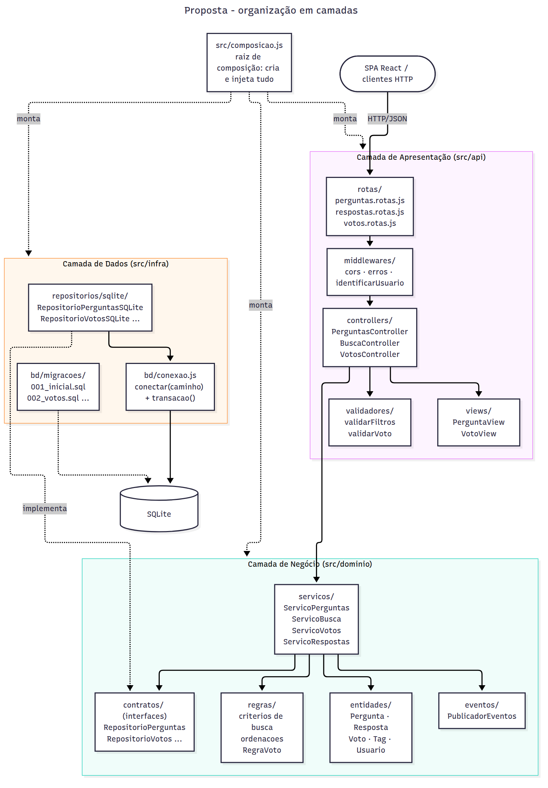
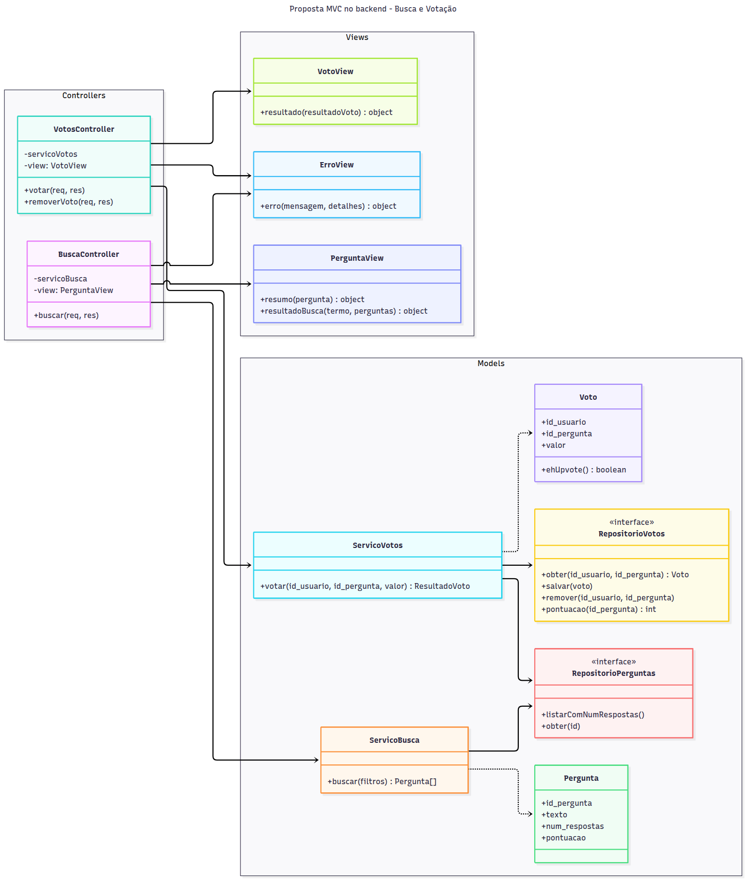
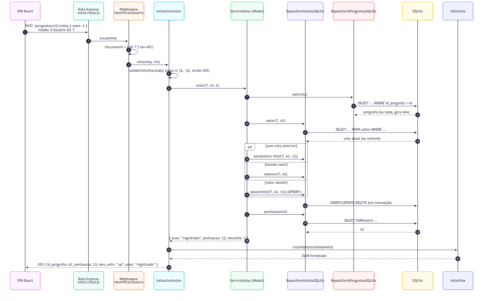

# Proposta de Organização Arquitetural

Esta proposta parte dos problemas levantados em [ARQUITETURA.md](ARQUITETURA.md): negócio misturado com dados, um arquivo único de rotas, nenhuma formatação própria das respostas e configuração fixa no código. A ideia central é simples: **manter o MVC que o projeto já adota, mas com camadas de verdade dentro do backend**, e com as dependências apontando sempre para o domínio.

Não proponho reescrever tudo de uma vez. O módulo `busca/` que implementei já segue esta organização, e a migração do restante pode ser incremental (ver o fim do documento).

---

## a) Separação em camadas

### Visão geral



*Fonte: [diagramas/proposta_camadas.mmd](diagramas/proposta_camadas.mmd)*

```
src/
├── api/                          # CAMADA DE APRESENTAÇÃO (HTTP)
│   ├── rotas/
│   │   ├── perguntas.rotas.js    # GET /perguntas, POST /perguntas, GET /perguntas/busca
│   │   ├── respostas.rotas.js    # GET/POST /perguntas/:id/respostas
│   │   └── votos.rotas.js        # POST/DELETE /perguntas/:id/votos
│   ├── controllers/
│   │   ├── PerguntasController.js
│   │   ├── BuscaController.js
│   │   ├── RespostasController.js
│   │   └── VotosController.js
│   ├── validadores/              # entrada HTTP -> dados válidos (ou 400)
│   │   ├── validarFiltros.js
│   │   └── validarVoto.js
│   ├── views/                    # objetos de domínio -> JSON da API
│   │   ├── PerguntaView.js
│   │   ├── VotoView.js
│   │   └── ErroView.js
│   └── middlewares/
│       ├── cors.js
│       ├── identificarUsuario.js
│       └── tratarErros.js
├── dominio/                      # CAMADA DE NEGÓCIO (não conhece HTTP nem SQL)
│   ├── entidades/                # Pergunta, Resposta, Voto, Tag, Usuario
│   ├── servicos/                 # ServicoPerguntas, ServicoBusca, ServicoVotos, ServicoRespostas
│   ├── regras/                   # criterios/ (busca), ordenacoes/ (Strategy), RegraVoto
│   ├── contratos/                # RepositorioPerguntas, RepositorioVotos... (abstrações)
│   ├── eventos/                  # PublicadorEventos (Observer)
│   └── erros.js                  # ErroValidacao, ErroNaoEncontrado, ErroNaoAutorizado
├── infra/                        # CAMADA DE DADOS
│   ├── repositorios/sqlite/      # RepositorioPerguntasSQLite, RepositorioVotosSQLite...
│   └── bd/
│       ├── conexao.js            # conectar(caminho), transacao(fn)
│       └── migracoes/            # 001_inicial.sql, 002_usuarios.sql, 003_votos.sql...
├── config.js                     # porta, caminho do banco (variáveis de ambiente)
├── composicao.js                 # raiz de composição: cria e injeta todas as dependências
└── servidor.js                   # cria o app com a composição e chama listen()
```

### Camada de Apresentação (`src/api`)

**Responsabilidades:**
- Receber requisições HTTP e **traduzi-las** para chamadas ao domínio: ler `req.params`, `req.query`, `req.body` e o usuário identificado.
- **Validar o formato** da entrada (tipos, tamanhos, campos obrigatórios) e responder **400** quando a entrada for inválida.
- **Formatar** a saída em JSON (as *views*) e escolher o **status HTTP**.
- Preocupações transversais de HTTP: CORS, identificação do usuário, tratamento centralizado de erros.

**Não faz:** regra de negócio (por exemplo, "um voto por usuário") nem SQL.

**Exemplos:** `perguntas.rotas.js` (só mapeia URL → método do controller), `VotosController`, `validarVoto`, `PerguntaView`, o middleware `tratarErros`.

### Camada de Negócio (`src/dominio`)

**Responsabilidades:**
- As **regras do fórum**: um voto por usuário por pergunta; clicar de novo no mesmo voto remove o voto; toda pergunta tem de 1 a 3 tags; quem responde a própria pergunta não gera notificação.
- **Orquestrar** casos de uso (serviços): "votar", "buscar", "cadastrar resposta e notificar".
- **Definir os contratos** (interfaces) de que precisa para persistência, sem saber como são implementados.
- **Publicar eventos** de domínio (`resposta.criada`, `voto.registrado`).

**Não faz:** não importa `express` nem `better-sqlite3`. Por isso é testável com dublês simples, em milissegundos.

**Exemplos:** `ServicoVotos`, `ServicoBusca`, `CriterioPalavraChave`, `OrdenacaoMaisVotadas`, a entidade `Voto` (com o método `ehUpvote()`), o contrato `RepositorioVotos`.

### Camada de Dados (`src/infra`)

**Responsabilidades:**
- **Implementar os contratos** do domínio usando SQLite: cada repositório concentra o SQL de uma entidade.
- **Gerenciar a conexão** e oferecer **transações**. A troca de voto (remover o antigo e inserir o novo) precisa ser atômica.
- **Evoluir o esquema** com migrações numeradas, em vez de recriar o banco do zero, o que apagaria os dados.

**Não faz:** não decide regra de negócio. O repositório de votos sabe *salvar* um voto, mas não sabe que "votar duas vezes igual remove o voto".

**Exemplos:** `RepositorioVotosSQLite`, `conexao.js`, `003_votos.sql`.

### Como as camadas se comunicam

1. **Regra de dependência:** Apresentação → Negócio ← Dados. A apresentação chama o domínio. A infraestrutura **implementa** os contratos do domínio (DIP). O domínio não depende de nenhuma das duas.
2. **Chamadas diretas em memória**, entre objetos. Não há rede entre as camadas, já que tudo roda no mesmo processo Node.
3. **Os dados cruzam as fronteiras como objetos simples** (entidades ou objetos literais), nunca como `req`, `res` ou linhas cruas do driver.
4. **Erros do domínio são tipados** (`ErroValidacao`, `ErroNaoEncontrado`, `ErroNaoAutorizado`). O middleware `tratarErros` da apresentação os converte em 400/404/401 num único lugar, eliminando o `try/catch` repetido em cada rota.
5. **Quem liga tudo** é `composicao.js`, o único arquivo que conhece as classes concretas:

```js
// src/composicao.js
function compor(config) {
  const bd = conectar(config.caminhoBanco);
  const publicador = new PublicadorEventos();

  const repoPerguntas = new RepositorioPerguntasSQLite(bd);
  const repoVotos     = new RepositorioVotosSQLite(bd);

  const servicoBusca = new ServicoBusca(repoPerguntas, [new CriterioPalavraChave(), new CriterioSemResposta()]);
  const servicoVotos = new ServicoVotos(repoVotos, repoPerguntas, publicador);

  return {
    buscaController: new BuscaController(servicoBusca, new PerguntaView()),
    votosController: new VotosController(servicoVotos, new VotoView()),
  };
}
```

---

## b) MVC no backend: Busca e Votação

### Como leio MVC numa API REST

Numa API que responde JSON, os três papéis ficam assim:
- **Model**: os dados **e** as regras sobre eles. Aqui, as entidades, os serviços de domínio e os contratos de repositório (a implementação SQL fica na camada de dados, por trás do Model).
- **View**: a **representação** enviada ao cliente. Numa API, a view é o formato do JSON: quais campos, com quais nomes, em qual estrutura. A SPA React é a view *para o usuário*, e as views do backend são a view *para a SPA*.
- **Controller**: recebe a requisição, valida, aciona o model e escolhe a view e o status.



*Fonte: [diagramas/proposta_mvc.mmd](diagramas/proposta_mvc.mmd)*

### Funcionalidade 1: Busca de perguntas (já implementada, reorganizada em MVC)

**Model**
- *Dados:* `Pergunta { id_pergunta, texto, id_usuario, num_respostas }`.
- *Operações:* `ServicoBusca.buscar(filtros)`, que usa `RepositorioPerguntas.listarComNumRespostas()` e os critérios (`CriterioPalavraChave`, `CriterioSemResposta`).
- Já existe hoje em `busca/`. Na reorganização, só mudaria de pasta.

**View**: `PerguntaView`

```js
class PerguntaView {
  resumo(p) {
    return { id: p.id_pergunta, texto: p.texto, respostas: p.num_respostas };
  }
  resultadoBusca(termo, perguntas) {
    return { termo, total: perguntas.length, perguntas: perguntas.map(p => this.resumo(p)) };
  }
}
```

A view desacopla o contrato da API do esquema do banco. Se a coluna `texto` mudar de nome, só o repositório muda, e o JSON continua igual. Ela também decide **o que não expor**: o `id_usuario` interno, por exemplo, sai da resposta.

**Controller**: `BuscaController`

```js
class BuscaController {
  constructor(servicoBusca, view) { this.servicoBusca = servicoBusca; this.view = view; }

  buscar = (req, res) => {
    const filtros = validarFiltros(req.query);            // lança ErroValidacao -> 400
    const perguntas = this.servicoBusca.buscar(filtros);
    res.json(this.view.resultadoBusca(filtros.q, perguntas));
  };
}

// src/api/rotas/perguntas.rotas.js
router.get('/perguntas/busca', buscaController.buscar);
```

Comparando com a rota atual em `server.js`, o `try/catch` desaparece, porque o middleware `tratarErros` o substitui para todas as rotas.

### Funcionalidade 2: Votação em perguntas (proposta)

**Model**
- *Dados:* nova tabela, com a regra "um voto por usuário por pergunta" garantida **pelo próprio banco**:

```sql
-- infra/bd/migracoes/003_votos.sql
CREATE TABLE votos (
  id_usuario   INTEGER NOT NULL,
  id_pergunta  INTEGER NOT NULL REFERENCES perguntas(id_pergunta) ON DELETE CASCADE,
  valor        INTEGER NOT NULL CHECK (valor IN (1, -1)),
  data_voto    TEXT    NOT NULL DEFAULT (datetime('now')),
  PRIMARY KEY (id_usuario, id_pergunta)
);
```

- *Entidade:* `Voto { id_usuario, id_pergunta, valor }`, com `ehUpvote()`.
- *Operação principal:* `ServicoVotos.votar(id_usuario, id_pergunta, valor)`, com a regra de negócio da História 3:

```js
class ServicoVotos {
  constructor(repoVotos, repoPerguntas, publicador) { /* injeção */ }

  votar(id_usuario, id_pergunta, valor) {
    if (!this.repoPerguntas.obter(id_pergunta)) throw new ErroNaoEncontrado('Pergunta não encontrada');

    const atual = this.repoVotos.obter(id_usuario, id_pergunta);
    let acao;
    if (!atual)                    { this.repoVotos.salvar(new Voto(id_usuario, id_pergunta, valor)); acao = 'registrado'; }
    else if (atual.valor === valor) { this.repoVotos.remover(id_usuario, id_pergunta);                 acao = 'removido'; }
    else                            { this.repoVotos.salvar(new Voto(id_usuario, id_pergunta, valor)); acao = 'trocado'; }

    const pontuacao = this.repoVotos.pontuacao(id_pergunta);
    this.publicador.publicar('voto.registrado', { id_pergunta, pontuacao });
    return { id_pergunta, acao, pontuacao, meuVoto: acao === 'removido' ? 0 : valor };
  }
}
```

- *Dados (infra):* `RepositorioVotosSQLite.salvar` usa `INSERT ... ON CONFLICT(id_usuario, id_pergunta) DO UPDATE SET valor = excluded.valor` (UPSERT), dentro de `transacao()`.

**View**: `VotoView`

```js
class VotoView {
  resultado(r) {
    return {
      id_pergunta: r.id_pergunta,
      pontuacao: r.pontuacao,
      meu_voto: { 1: 'up', '-1': 'down', 0: null }[r.meuVoto],
      acao: r.acao,
    };
  }
}
```

Os valores internos (+1/−1) viram `"up"`/`"down"` para o frontend, que usa `meu_voto` para destacar o botão certo.

**Controller**: `VotosController`

```js
class VotosController {
  constructor(servicoVotos, view) { this.servicoVotos = servicoVotos; this.view = view; }

  votar = (req, res) => {
    const { valor } = validarVoto(req.body);               // valor ∈ {1, -1}, senão 400
    const resultado = this.servicoVotos.votar(req.usuario.id, Number(req.params.id), valor);
    res.status(200).json(this.view.resultado(resultado));
  };
}

// src/api/rotas/votos.rotas.js
router.post('/perguntas/:id/votos', identificarUsuario, votosController.votar);
```

O middleware `identificarUsuario` lê o identificador do usuário (um cabeçalho `X-Usuario-Id` nesta primeira versão, e depois um token de login) e responde **401** se ele não vier. Assim, o controller nunca precisa se preocupar com isso.

### Exemplo de fluxo completo: requisição → resposta (votar)



*Fonte: [diagramas/proposta_fluxo_votacao.mmd](diagramas/proposta_fluxo_votacao.mmd)*

**Requisição** (o usuário 7 clica em ▲ na pergunta 42):

```http
POST /perguntas/42/votos HTTP/1.1
Content-Type: application/json
X-Usuario-Id: 7

{ "valor": 1 }
```

**Caminho percorrido:**

| # | Camada | Componente | O que acontece |
|---|---|---|---|
| 1 | Apresentação | `cors`, `express.json` | Cabeçalhos CORS e leitura do corpo JSON. |
| 2 | Apresentação | `votos.rotas.js` | A URL casa com `POST /perguntas/:id/votos`. |
| 3 | Apresentação | `identificarUsuario` | `req.usuario = { id: 7 }` (sem cabeçalho → 401). |
| 4 | Apresentação (C) | `VotosController.votar` | `validarVoto` confirma que `valor ∈ {1, -1}` (senão → 400). |
| 5 | Negócio (M) | `ServicoVotos.votar(7, 42, 1)` | Verifica se a pergunta existe (senão → 404). |
| 6 | Dados | `RepositorioVotosSQLite.obter(7, 42)` | `SELECT` do voto atual: nenhum. |
| 7 | Negócio (M) | `ServicoVotos` | Regra: sem voto anterior → registrar. |
| 8 | Dados | `RepositorioVotosSQLite.salvar(...)` | `INSERT ... ON CONFLICT DO UPDATE`, em transação. |
| 9 | Dados | `RepositorioVotosSQLite.pontuacao(42)` | `SELECT SUM(valor)` → 13. |
| 10 | Negócio | `PublicadorEventos` | Publica `voto.registrado` (por exemplo, para invalidar o cache da listagem). |
| 11 | Apresentação (V) | `VotoView.resultado` | Monta o JSON público. |
| 12 | Apresentação (C) | `VotosController` | `res.status(200).json(...)`. |

**Resposta:**

```http
HTTP/1.1 200 OK
Content-Type: application/json

{ "id_pergunta": 42, "pontuacao": 13, "meu_voto": "up", "acao": "registrado" }
```

**Se o usuário clicar em ▲ de novo**, o passo 7 cai no caso "mesmo valor", o voto é removido, e a resposta é `{ "pontuacao": 12, "meu_voto": null, "acao": "removido" }`. **Se clicar em ▼**, o caso é "valor oposto", e a resposta é `{ "pontuacao": 11, "meu_voto": "down", "acao": "trocado" }`. As três respostas correspondem aos caminhos do [diagrama de atividades](diagramas/diagrama_atividades.png) da Parte 2.

**Em caso de erro**, qualquer camada lança um erro tipado, e o middleware `tratarErros` produz uma resposta uniforme via `ErroView`:

```json
{ "erro": { "codigo": "NAO_ENCONTRADO", "mensagem": "Pergunta não encontrada" } }
```

---

## Como migrar sem parar o projeto

Uma reorganização desse tamanho não precisa (nem deve) ser feita de uma vez só. Seguindo a ideia de refatoração contínua do XP, eu faria em passos pequenos, cada um com os testes passando:

1. **Extrair `config.js` e `composicao.js`**, e fazer `bd/conexao.js` receber o caminho do banco, em vez de abri-lo no `require`.
2. **Criar o middleware `tratarErros`** e remover os `try/catch` das rotas.
3. **Mover `busca/`** para `dominio/` (serviço, critérios, contrato) e `infra/` (repositório SQLite). A estrutura já existe, então é só mudar de pasta.
4. **Quebrar `modelo.js`** em `RepositorioPerguntasSQLite`/`RepositorioRespostasSQLite` (dados) e `ServicoPerguntas`/`ServicoRespostas` (negócio), mantendo as rotas antigas funcionando.
5. **Introduzir as views** e os novos nomes de rota (`GET /perguntas`), mantendo as rotas antigas como *aliases* até o frontend migrar.
6. **Implementar a votação** já na estrutura nova. Ela é a primeira funcionalidade que nasce organizada desde o início.

A cada passo, os testes existentes (37 hoje) garantem que nada quebrou. Os testes novos de serviço rodam sem banco, graças à separação de camadas.
